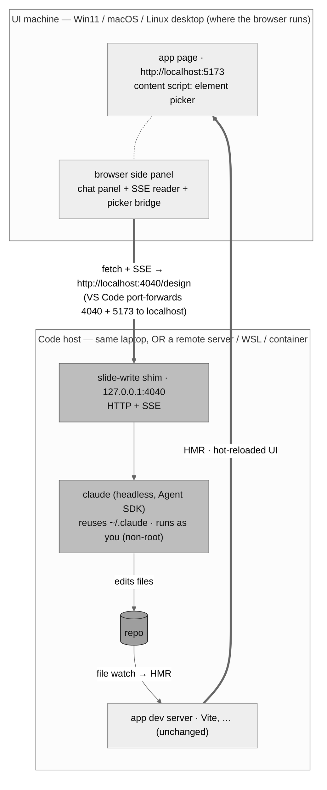
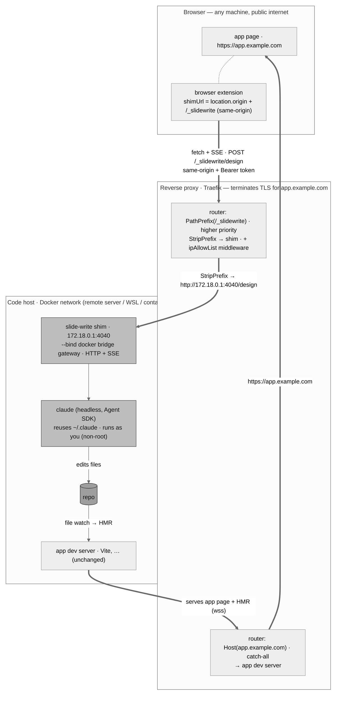

# Slide Write

**A portable, project-agnostic AI design assistant.** A browser extension adds an element-picker to
your running app and a chat panel in the browser's side panel. Click an element or type a request; a
tiny local **shim** drives **`claude`** headless against your repo; your dev server hot-reloads; the
change appears live — with **zero changes to the target project's source.**

The shim runs `claude` the same way your editor already does (headless, streaming) and reuses your
existing `~/.claude` login — **no API key, no Docker, no reverse proxy.** The browser reaches the
shim over **VS Code's built-in port forwarding**, so the exact same setup works whether your code
is on the laptop or on a remote server, on **Windows / macOS / Linux**.

> Two deliverables:
> 1. **`shim/`** — a cross-platform Node CLI: runs `claude` in a repo and streams the run as SSE on `127.0.0.1:<port>`.
> 2. **`extension/`** — a Manifest V3 browser extension: the universal, framework-agnostic UI.

## Demo

https://github.com/user-attachments/assets/3aec869a-b4e2-40f2-b51b-7c99191d2ff7

## Why I built this

I loved the DOM element picker paired with a Claude Code chat in claude.ai/design, but I needed a
tool that worked against a local development environment. Along the way I realized the same tool
could also generate and embed image assets.

This README is self-contained and buildable: it inlines every contract, the shim's core code, and
the extension spec. It's written to be implemented by **Claude Code** — see [§12](#12-build-order-for-claude).

---

## Table of contents

1. [What you get](#1-what-you-get)
2. [Repository layout](#2-repository-layout)
3. [Architecture](#3-architecture)
4. [Why this reaches everywhere](#4-why-this-reaches-everywhere)
5. [The shim (`shim/`)](#5-the-shim-shim)
6. [The SSE event contract](#6-the-sse-event-contract)
7. [The element-capture contract](#7-the-element-capture-contract)
8. [The browser extension (`extension/`)](#8-the-browser-extension-extension)
9. [Discovery & routing](#9-discovery--routing)
10. [Security model](#10-security-model)
11. [Quick start](#11-quick-start)
12. [Build order for Claude](#12-build-order-for-claude)
13. [Fallback: public-hostname access via a reverse proxy](#13-fallback-public-hostname-access-via-a-reverse-proxy)
14. [Prior art](#14-prior-art)

---

## 1. What you get

- A **browser extension** with a toolbar button / shortcut that opens a chat panel in the browser's
  **side panel** (docked beside the page, which reflows to make room). Type a prompt ("make the
  primary button green") → the shim drives `claude` → the running app hot-reloads → you see it in
  seconds.
- A **Markup mode**: hover to highlight elements, click one to describe a change anchored to it; the
  clicked element's context (tag, classes, text, DOM path) is sent so `claude` finds the source.
  Picks **stack** — the picker stays armed, so consecutive clicks add elements (up to 5 per
  message), each shown as its own removable chip; 🎯 again or Esc finishes picking.
- The panel streams **thinking, tool calls, file edits, tool output, a final summary, and run
  stats** live over SSE, and shows the commit each run makes.
- **Reusable across projects.** The shim is generic; per-project knowledge comes from the target
  repo's own `CLAUDE.md`. Adding it to a project is: run the shim pointed at the repo, enable the
  origin in the extension. **No edits to the project's source.**

Single-developer, trusted-local tool ([§10](#10-security-model)).

---

## 2. Repository layout

```
.
├── README.md                       # this spec
├── CLAUDE.md                       # guidance for implementing/extending this repo
│
├── shim/                           # the local agent: claude → SSE on loopback
│   ├── package.json                # bin: "slide-write"; dep: @anthropic-ai/claude-agent-sdk
│   ├── slide-write.mjs             # the CLI (HTTP server + SDK run loop + SSE mapping + commit)
│   └── slide-write.py              # stdlib-only Python port for hosts without Node (§5.3)
│
└── extension/                      # the Manifest V3 browser extension (the universal UI)
    ├── manifest.json               # side_panel + <all_urls>; content script (picker) on localhost
    ├── background.js               # config store (chrome.storage); messaging; opens the side panel
    ├── sidepanel.html              # the side-panel document (loads styles.css + sidepanel.js)
    ├── sidepanel.js                # side-panel host: per-active-tab config, SSE, picker bridge (§8.4)
    ├── content/
    │   ├── inject.js               # content script: picker bridge only — arms picker, crops shots (§8.4)
    │   ├── picker.js               # capture-phase element picker (§8.3)
    │   ├── panel.js                # chat transcript + composer (renders the §6 events; runs in the panel)
    │   └── sse.js                  # fetch + getReader SSE reader (§8.2, verbatim)
    ├── options.html
    ├── options.js                  # per-origin config: enabled + token + shim URL
    ├── popup.html
    ├── popup.js                    # quick enable/disable + "wired to <project>" via /meta
    └── styles.css                  # the side-panel document's styles
```

No Docker, no compose overlay, no reverse-proxy config — the shim is a plain process and the
transport is VS Code's port forwarding.

---

## 3. Architecture

The shim binds **loopback on the machine where the code lives** (your laptop, or a remote
server/WSL/container). **VS Code's port forwarding** makes that loopback port — and your app's dev
port — appear at `localhost:<port>` on the machine where the browser runs. So the extension always
talks to `http://localhost:<port>`, and **local dev and remote dev look identical** to it.



The load-bearing property: **the shim and the dev server share the repo through the filesystem.**
`claude` writes files; the project's own dev server sees the change and hot-reloads. The shim never
imports the project's code.

The diagram above is the **default** path — the app opened at a VS Code-forwarded `localhost` URL.
To serve it at a public hostname like `https://app.example.com` instead, see the reverse-proxy
variant in [§13](#13-fallback-public-hostname-access-via-a-reverse-proxy).

---

## 4. Why this reaches everywhere

VS Code forwards loopback ports **identically** in every remote mode and on every OS — that's the
entire trick. Bind the shim to `127.0.0.1`, open your app via its forwarded `localhost` URL, and:

| Setup | Where the shim + code live | How the browser reaches the shim |
|---|---|---|
| **Local** (Win / macOS / Linux) | the laptop | direct `localhost:4040` (forwarding is a no-op) |
| **Remote-SSH** → a Linux server | the server | VS Code forwards over its SSH channel |
| **Windows + WSL** | WSL | VS Code forwards WSL → Windows localhost |
| **Dev Container** | the container | VS Code forwards container → host |
| **Codespaces / Tunnels** | the cloud VM | VS Code's forwarded URL |

From the browser's point of view everything is `localhost`, so there's **one extension code path
and one shim** — no topology awareness, no per-OS install. The one habit that keeps it uniform: in
remote dev, **open the app through its VS Code-forwarded `localhost` URL**, not a public hostname.
(If you must use a public hostname, see the [reverse-proxy fallback](#13-fallback-public-hostname-access-via-a-reverse-proxy).)

Credential portability is the `claude` CLI's job: the shim runs `claude` (via the Agent SDK), which
already knows where your login lives on each OS — so reusing your subscription works the same on
Windows, macOS, and Linux with no API key.

---

## 5. The shim (`shim/`)

A small Node CLI. It serves HTTP+SSE on loopback and drives `claude` headless via the Agent SDK.
Because it runs as **you (non-root)**, it can use `permissionMode: "bypassPermissions"` directly —
no permission-prompt callback, no root workarounds. Edits are written as your user, so they're
yours.

### 5.1 `shim/package.json`
```json
{
  "name": "slide-write",
  "version": "0.1.0",
  "type": "module",
  "bin": { "slide-write": "slide-write.mjs" },
  "dependencies": { "@anthropic-ai/claude-agent-sdk": "^0.3.168" }
}
```
The SDK reuses `~/.claude` automatically (or `ANTHROPIC_API_KEY` if set). Run with
`node shim/slide-write.mjs …`, or `npm i -g ./shim` then `slide-write …`, or `npx`.
*(Equivalent zero-dep alternative: shell out to `claude -p --output-format stream-json` and reframe
its JSONL as SSE — same event mapping. The SDK is used here for typed messages.)*

### 5.2 `shim/slide-write.mjs`

A single `.mjs` file. CLI flags / env
(`--port`/`--repo`/`--token`/`--origin`/`--bind`/`--model`/`--debug`/`--use-skills`, the multi-host
flags `--repo-root`/`--repos`, plus the image flags
`--gemini-key`/`--gemini-model`/`--image-instructions`) configure it; it stands up an
`http.createServer` on `127.0.0.1` (overridable via `--bind` for §13 only), and the run logic lives
in exported `runDesign(body, emit, aborted, signal, repo)` / `runImage(body, emit, aborted, signal,
repo)` so the HTTP handler and tests share one implementation (the server only starts when the file
is run directly, behind an `import.meta.url` guard).

**Multi-host mode (for the §13 proxy fallback):** passing `--repo-root <dir>` and/or `--repos
host=path,…` makes the shim serve MANY repos, resolving the target per request from the `Host`
header: explicit `--repos` entry first, then `localhost`/`127.0.0.1` falls back to `--repo`
(so VS Code-forwarded access keeps working), then the host's first DNS label is looked up under
`--repo-root` (`life-ops.dev.example.com` → `<root>/life-ops`; the label is sanitized —
a Host header is attacker-controlled text, never a path). Unmapped hosts get 404 on every route
but `/health`. The busy lock is per-repo: two projects can run concurrently, a second run on the
same repo is still rejected. Without these flags the shim is single-repo and ignores `Host`
entirely — the original behavior.

**The system prompt is the interesting part** — it's what makes a generic shim behave well against
any repo. It's deliberately project-agnostic (per-project knowledge comes from the target's own
`CLAUDE.md`, loaded via `settingSources: ["project"]`):

Rendered, the system prompt reads:

> You are editing a web app live from within its running dev environment. Your edits land on the
> repo at the working directory and the app's own dev server hot-reloads, so changes appear in the
> browser within seconds.
>
> FIRST, read the repo's CLAUDE.md (and README) for THIS project's conventions — where styling
> lives, where components/screens live, the framework in use. Follow them.
>
> - Make the SMALLEST focused change that satisfies the request, in the spirit of the existing code.
> - Reuse existing tokens/components/patterns; don't add dependencies unless asked.
> - Do NOT edit Dockerfiles, CI, or anything under .claude / .env / credentials.
> - Keep schema/model changes ADDITIVE; never rename, drop, or retype an existing table or column.
> - When done, reply with one or two sentences describing exactly what you changed.

The verbatim source string lives at `PREAMBLE` in `shim/slide-write.mjs` (and the Python port in
`shim/slide-write.py`); keep this prose in sync with both if you edit it.

The other load-bearing bit is **how the clicked elements become prompt context.** A request may
carry up to **5** stacked targets ([§7](#7-the-element-capture-contract) `elements`; the
`elementsOf()` helper normalizes — legacy single `element` accepted — and re-caps server-side).
`buildPrompt()` joins the typed request with the current `screen` and, per element, a compact JSON
of its tag/class/text/`domPath`, then instructs `claude` to use those to locate the source:

```js
parts.push(`\n[The user clicked this on-screen element${nth(i)} and is referring to it]\n` +
  JSON.stringify(ctx, null, 2) +
  "\nUse the class names / text / DOM path to locate the source and matching styles, then edit there.");
```

`nth(i)` numbers the blocks (`" (element 2 of 3)"`) only when several were picked, so the
single-element prompt is unchanged.

When an element carries a screenshot ([§7](#7-the-element-capture-contract) `screenshotDataUrl`),
`runDesign` writes it to a temp PNG **outside the repo** (`saveScreenshot()`, the same temp-file
pattern `runImage` uses; one file per element, index-suffixed so same-millisecond picks don't
collide) and `buildPrompt` appends a line telling `claude` to `Read` that path — its Read tool
renders the image, so the agent sees how the element looks before editing. No Agent-SDK
image-input plumbing is needed. Clipboard-pasted images ([§7](#7-the-element-capture-contract)
`pasted`) ride the same `elements`/`screenshotDataUrl` temp-file path; `buildPrompt` only swaps in
neutral "[The user pasted this image…]" wording keyed off the `pasted` flag.

Everything else is mechanical and may be implemented freely as long as it honors these contracts:

- **The SDK run loop.** `query({ prompt, options })` is driven with `cwd: REPO`,
  `permissionMode: "bypassPermissions"` **plus** `allowDangerouslySkipPermissions: true` (the SDK
  requires both; the shim runs as you/non-root, so no permission callback is needed),
  `includePartialMessages: true`, `settingSources: ["project"]`, `systemPrompt: PREAMBLE`,
  `maxTurns: 40`. The loop dispatches on `m.type` and maps each SDK message to a §6 SSE event —
  `system/init`→`start`, `content_block_delta`→`delta`/`thinking_delta`, `tool_use`→`file_edit`
  (for Edit/Write/MultiEdit/NotebookEdit) or `tool`, `tool_result`→`tool_result`, `result`→`result`;
  assistant-message usage (deduped by message id, seeded early by `message_start`) plus
  `system/thinking_tokens`→ the cumulative `usage` event (§6 "Live token usage").
  `--debug`/`SW_DEBUG` logs each `m.type`/`m.subtype` to stderr. Bail immediately when `aborted()`
  (client disconnect) returns true. `--use-skills`/`SLIDEWRITE_USE_SKILLS` adds `skills: "all"` so the
  target repo's `.claude/skills/` are loaded (off by default — `settingSources:["project"]` alone does
  not enable skills).
- **Auto-commit only what this run changed.** Snapshot `git status --porcelain -uall` before the
  run, diff after, `git add` + commit just the new paths under a `Slide Write` identity (no push),
  emit `commit`. **Parse porcelain untrimmed** (`line.slice(3)`) — the leading status-column space
  is significant, so a path's first character would be eaten by a trimming helper. A request may
  opt out with a top-level `autoCommit: false` (§6) — the run then leaves its edits uncommitted in
  the working tree and no `commit` event fires; absent/anything-else keeps the commit.
- **HTTP server.** CORS (allow only `ORIGIN`; include `Access-Control-Allow-Private-Network`),
  a `Bearer <token>` gate on every route except `/health` (401 first), the `busy` single-run lock,
  and routes `/health`, `/meta`, `/history`, `/history/<id>`, `POST /design`, `POST /generate-image`.

**Validated against `@anthropic-ai/claude-agent-sdk` 0.3.168.** Message/block shapes (`stream_event`
deltas, `tool_use`/`tool_result` blocks) can drift across SDK versions; the loop dispatches on
`m.type` defensively — verify against the installed SDK during the phase-1 smoke test
([§12](#12-build-order-for-claude)).

### 5.3 `shim/slide-write.py` — the Python shim (servers without Node)

A stdlib-only Python 3.10+ port of `slide-write.mjs` for hosts where Node isn't available. Same
HTTP+SSE surface, same flags/env, same §6/§7 contracts — the extension can't tell the two apart.
Instead of the Agent SDK it shells out to the `claude` CLI headless (the zero-dep alternative §5.1
mentions): `claude -p --output-format stream-json --verbose --include-partial-messages
--dangerously-skip-permissions --setting-sources project --system-prompt <PREAMBLE> --max-turns 40`,
with the prompt fed on stdin and the JSONL reframed as §6 SSE — the CLI's stream is the same message
stream the SDK yields, so the mapping mirrors the `.mjs` line for line. `claude` itself needs no
Node either: the native installer (`curl -fsSL https://claude.ai/install.sh | bash`) ships a
self-contained binary that reuses the same `~/.claude` login.

```
python3 shim/slide-write.py --repo <path> --port 4040 --origin http://localhost:5173 --token <secret>
```

Differences from the Node shim (all invisible to the client):

- **`--claude-bin <path>`/`SLIDEWRITE_CLAUDE_BIN`** (extra flag) — the `claude` binary to drive,
  for environments where it isn't on `PATH` (e.g. a bare systemd unit).
- **Skills parity is inverted at the CLI:** the CLI loads skills by *default* (the SDK doesn't), so
  without `--use-skills` the shim passes `--disable-slash-commands` to match the Node shim's
  no-skills default.
- **SSE framing is close-delimited** (`Connection: close`; `BaseHTTPRequestHandler` doesn't chunk)
  rather than Node's chunked encoding — the §8.2 fetch-reader handles both identically.
- **Client disconnect** is detected by a failed SSE write or a socket EOF peek between stream
  messages; either kills the `claude` child. The in-flight Gemini call has no abort signal
  (urllib) — a disconnect during generation is noticed right after it returns.

Validated against `claude` CLI 2.1.173 — same drift caveat as the SDK: re-verify the stream-json
shapes on upgrade. Keep this file in lockstep with `slide-write.mjs` (the `.mjs` is the reference
implementation; both must change together with the contracts).

---

## 6. The SSE event contract

Every frame is **one JSON object on a `data:` line**; the client reads only `data:`. Each has a
`type`. This is the interface between `shim/` and `extension/`.

| `type` | payload | client action |
|---|---|---|
| `start` | `{sessionId, model}` | status row "Started · `<model>`" |
| `delta` | `{text}` | append to the current assistant bubble |
| `thinking_delta` | `{text}` | append to the current thinking bubble |
| `usage` | `{inputTokens, outputTokens, cacheReadTokens, cacheCreationTokens, thinkingTokens}` | cumulative live token counter — spinner + count in the status bar |
| `tool` | `{tool, detail, id}` | compact tool row (`detail` = command/file/pattern) |
| `file_edit` | `{tool, path, id}` | edit row (✏️ `path`) |
| `tool_result` | `{tool, id, text, isError, truncated}` | collapsible output (auto-open on error) |
| `result` | `{isError, numTurns, durationMs, totalCostUsd, usage, result}` | stats footer; `result` is the final-text fallback if no deltas streamed |
| `commit` | `{sha, count}` | green "Committed `<sha>` · N files" |
| `commit_error` | `{message}` | red error row (commit didn't land — edits remain in the working tree) |
| `image_status` | `{state}` | status row (`state:"generating"` → "generating image…"); emitted only by `/generate-image` |
| `image_generated` | `{tmpPath, mimeType, bytes}` | note row "🖼️ image generated"; metadata only (no image bytes over the wire) |
| `error` | `{message}` | error row |
| `done` | `{}` | end of stream; clear the busy indicator; if the per-origin **auto-reload on save** option is on and any `file_edit` fired this run, reload the page (for apps without hot-reload) |

Adding a new `type` is backward-compatible: clients ignore unknown types.

| `user` | `{text}` | user bubble (history replay only; live runs render the user bubble inline in `send()`) |

The `user` event is emitted only by `GET /history/<id>` (below), not by a live `/design` run.

**Live token usage (additive).** During a run the shim emits cumulative `usage` events so the client
can show a running token counter while `claude` works. The authoritative per-API-call usage arrives
with each SDK assistant message — accumulated **deduped by message id** (partials and multi-block
messages repeat the same usage; `message_start` stream events seed an entry early with the
input/cache counts). Between turns, the SDK's `system/thinking_tokens` estimate fills the gap while
the model thinks: it accrues into `thinkingTokens` and resets when the next authoritative usage
lands (whose `output_tokens` already includes that thinking — so the client's live count is
`outputTokens + thinkingTokens` without double-counting). Thinking-driven emits are throttled
(~250ms); turn-boundary emits are immediate. The final `result` event's `usage`/`totalCostUsd`
remain the authority for the stats row — there is no streamed mid-run cost, so cost shows only at
the end. `usage` is live-only: it is not persisted to transcripts and `GET /history/<id>` does not
replay it.

**Model selection (additive).** `/design` accepts an optional top-level `model` (a model id). The
shim validates it against an allowlist advertised by `/meta` (`{ models: [{id,label}], defaultModel }`);
an unknown/absent id falls back to the shim's `--model`/`SLIDEWRITE_MODEL` default, or the SDK's own
default when that's unset. The model the SDK actually runs is echoed back in the `start` event. The
extension renders the `/meta` list in a composer dropdown and persists the choice per-origin.

**Image generation (additive — Gemini "nano banana").** `POST /generate-image` is an SSE route
(same Bearer+CORS gate, same `busy` lock and per-run auto-commit as `/design`). It takes
`{ imagePrompt, elements, geminiKey, imageInstructions, screen, model, autoCommit }` (`elements` as
in [§7](#7-the-element-capture-contract) — ≤5 targets, legacy single `element` accepted). The shim calls Google's
Generative Language API (model id from `--gemini-model`/`SLIDEWRITE_GEMINI_MODEL`, default
`gemini-2.5-flash-image`) with the key in an `x-goog-api-key` header — never the URL, so it can't
leak into logs. If an element's `imageDataUrl` is present (the user picked an ``; the picker captured
its pixels via canvas), it's sent as an inline image part for image-to-image — the first element
carrying pixels wins, since Gemini takes one source image; otherwise it's
text-to-image. The decoded image is written to a temp file **outside the repo**, an `image_generated`
event fires, and the shim then drives `claude` (via the normal §6 stream) to copy the asset into the
project and wire it into the picked element(s). Key resolution: `body.geminiKey` →
`--gemini-key`/`GEMINI_API_KEY`; missing → an `error` event. `/meta` advertises
`{ geminiModel, geminiEnv }` (`geminiEnv` = the shim has a server-side key). The extension stores one
**global** Gemini key (shared across origins).

**Where image-save conventions live (precedence low→high).** Save path, naming, resizing, DB/CDN
steps differ per project, so they belong **in the target repo**, not the browser:

1. **`CLAUDE.md` `## Image assets` section** — the default; always in context, deterministic, no code
   change. The shim's image prompt already says "follow the project's image conventions."
2. **`.claude/skills/image-asset/SKILL.md`** — for *procedural* handling (resize with a bundled
   script, multi-dir, insert a `media` row, push to a CDN). A Skill can ship scripts and is
   model-invoked by its `description`. **Requires running the shim with `--use-skills`** (or
   `SLIDEWRITE_USE_SKILLS=1`) — `settingSources:["project"]` alone does *not* enable skills; that flag
   passes `skills:"all"` to the SDK query (and applies to `/design` too). Use a Skill when the
   procedure is large/reusable; use CLAUDE.md when it's just a path/naming rule.
3. **Per-origin “Image steps (override)”** — the extension field (sent as `imageInstructions`,
   appended last, wins). A per-developer override / quick experiment, *not* the source of truth.
   Falls back to `--image-instructions`/`SLIDEWRITE_IMAGE_INSTRUCTIONS`.

Minimal `.claude/skills/image-asset/SKILL.md` in a target repo:

```markdown
---
name: image-asset
description: Save a generated/provided image into this app and reference it. Use whenever an image
  file needs to be added to the project and wired into a component.
---
- Put images in `src/assets/generated/`, kebab-cased from the prompt, `.webp` when possible.
- Resize to max width 1024 with `node scripts/resize.mjs <file>`.
- Import the asset in the component (Vite `import url from '…'`); never hardcode `/public` paths.
- After adding, insert a row into the `media` table via `npm run media:register -- <path>`.
```

…or, for simple projects, just a CLAUDE.md stub:

```markdown
## Image assets
Generated images go in `public/img/`, kebab-cased; reference them with a root-relative `/img/…` URL.
```

**Chat history (read-only).** `claude` writes one `.jsonl` transcript per session under
`~/.claude/projects/<encoded-cwd>/` (the cwd with every non-alphanumeric char turned into a single
`-`; matched case-insensitively against the directory listing). Two GET routes, behind the same
Bearer+CORS gate as `/meta`, expose the **current repo's** sessions:

- `GET /history` → `{ sessions: [{ id, title, firstPrompt, startedAt, endedAt, branch, messageCount }] }`,
  newest first. `title` is the session's `ai-title` if present, else its first user prompt. Missing
  project folder → `{ sessions: [] }`.
- `GET /history/<id>` → `{ id, events: [...] }`, where `events` reuses the §6 shapes above (plus the
  `user` event) so the panel replays a past session through the same renderer. `id` must be a valid
  session UUID (regex-validated + path-traversal-guarded); a bad/missing id → 404. Lifecycle events
  (`start`/`commit`/`done`) are not emitted for a replay.

**Auto-commit opt-out (additive).** `/design` and `/generate-image` accept an optional top-level
`autoCommit` (boolean). When it is **exactly `false`**, the shim skips the per-run commit — the
run's edits stay uncommitted in the working tree and no `commit` event is emitted. (Auto-reload-on-save
still fires regardless, since it keys off `file_edit`, not `commit`.) Absent or any other value keeps the default
auto-commit, so old clients are unaffected. The extension exposes this as a per-origin
**auto-commit** checkbox (on by default) in Options and sends the resolved value with every run.

**Resume (additive).** `/design` accepts an optional top-level `resume` (a session UUID). When
present and valid, the shim passes `resume` to the SDK `query` so the run continues that
conversation. The `busy` lock and the per-run auto-commit (diff of `git status` before/after) are
unaffected — only files changed by *this* run are committed. An absent/invalid value starts fresh.
The extension's 🕘 history view offers a **↻ Resume** action that threads subsequent sends into the
chosen session.

**Multiple element targets (additive).** `/design` and `/generate-image` accept a top-level
`elements` array of [§7](#7-the-element-capture-contract) captures — the composer stacks up to
**5** picks per message (capped on both sides so the prompt/context window stays sane; the shim
re-caps with `slice(0, 5)`). The legacy single top-level `element` is still accepted (normalized to
a one-entry array), so old clients are unaffected.

---

## 7. The element-capture contract

When the user clicks an element in Markup mode, its capture is added to the composer as a removable
chip. Picks **stack** — the picker stays armed, so each consecutive click appends another target, up
to **5 per message** (the cap auto-disarms the picker and keeps the prompt/context window sane; the
shim re-caps server-side). Picking ends via Esc, clicking 🎯 again, or the cap. On send the extension POSTs
them as a top-level `elements: [ … ]` array (plus a top-level `screen` = current route/view, i.e.
`location.pathname + location.search + location.hash`, so hash-based routes are captured too); the
shim also still accepts the legacy single top-level `element`. Each entry:

```jsonc
{
  "tag": "button",
  "id": null,
  "className": "btn btn-primary",   // full class string
  "text": "New",                    // textContent, trimmed, ≤120 chars
  "domPath": "div.topbar > button.btn.btn-primary",  // nth-of-type chain, ≤5 ancestors, stops at first id
  "rect": { "x": 1180, "y": 16, "w": 64, "h": 32 },
  "imageDataUrl": "data:image/png;base64,…",      // optional; present only when the target is an 
  "screenshotDataUrl": "data:image/png;base64,…", // optional; a screenshot of the picked element
  "screenshotW": 64, "screenshotH": 32,           // UI-only (chip label); not forwarded to the shim
  "pasted": true                                  // optional; set only for clipboard-pasted images (no DOM fields)
}
```
Centralized, semantic class names usually pinpoint the source; for CSS-in-JS / hashed classes, lean
on `text` + `domPath` + `screen`, or add framework-fiber data ([§8.4](#84-the-widget-the-bridge--remaining-files)).

`screenshotDataUrl` is captured on **every** pick: Chrome has no "screenshot this element" API, so the
background worker grabs the visible tab (`chrome.tabs.captureVisibleTab`) and the content script crops
it to `rect` (scaling by `devicePixelRatio`, clamping to the viewport, downscaling to a modest max
edge). Capture is best-effort — restricted pages, a zero-size rect, or a load failure just yield no
screenshot and the flow degrades to text-only. The composer shows it as a **removable attachment
chip** under that element's identity chip (thumbnail + dimensions + ✕); removing it drops the pixels
so they're never sent. On `/design`
the screenshots ARE sent (with the UI-only `screenshotW/H` stripped) — the shim writes each to a temp
file and asks `claude` to `Read` it ([§5](#5-the-shim-shim)). On `/generate-image` they're stripped
(that route uses `imageDataUrl` instead).

`imageDataUrl` is captured on every pick where the target is an `` whose pixels the picker could
read (same-origin / CORS-enabled canvas; tainted images are silently skipped). The composer keeps it
only when **Image Generation** is toggled on (the "+" menu in the send area) — then it drives
image-to-image in `/generate-image`; for plain `/design` sends the composer strips it back out, so it
never bloats a non-image request. Image Generation is a per-send toggle, not a separate picker: pick
any element with 🎯, flip the toggle, and the shim places the generated image as the ``'s `src`
or the element's CSS `background-image` depending on the element type.

**Pasted images.** With the composer focused, Ctrl/Cmd+V of a copied image (e.g. a screenshot)
creates a synthetic capture — no DOM fields, `pasted: true`, with both `screenshotDataUrl` and
`imageDataUrl` set to the same PNG downscaled to a max edge of 1024. It stacks as a removable
`📋 pasted image · W×H` chip against the same 5-target cap (text paste falls through untouched). On
`/design` the kept `screenshotDataUrl` is written to a temp file for `claude` to `Read`; on
`/generate-image` the kept `imageDataUrl` is used as the image-to-image source. Keyed off `pasted`,
the shim swaps the "screenshot of the selected element" wording for neutral "[The user pasted this
image…]" wording so `claude` decides from the request whether it's a visual reference or an asset to
place.

---

## 8. The browser extension (`extension/`)

Manifest V3. The chat UI lives in the browser's **side panel** (`sidepanel.html`, an extension page)
— so it docks beside the page (which reflows) instead of overlapping it, and it **persists while
open**, surviving a whole run regardless of the MV3 service-worker idle-kill. The element **picker**
stays a **content script** in the page (`content/inject.js`) — only a content script can hit-test
the app's DOM and overlay a highlight. The two halves coordinate over runtime messaging ([§8.4](#84-the-widget-the-bridge--remaining-files)).

### 8.1 `manifest.json`
```jsonc
{
  "manifest_version": 3,
  "name": "Slide Write",
  "version": "0.2.x",
  "permissions": ["storage", "activeTab", "scripting", "sidePanel", "tabs"],
  "host_permissions": ["<all_urls>"],
  "optional_host_permissions": ["https://*/*", "http://*/*"],
  "background": { "service_worker": "background.js" },
  "action": { "default_title": "Slide Write — open panel", "default_icon": { /* … */ } },
  "side_panel": { "default_path": "sidepanel.html" },
  "content_scripts": [{
    "matches": ["http://localhost/*", "http://127.0.0.1/*", "https://localhost/*"],
    "js": ["content/inject.js"],
    "run_at": "document_idle"
  }],
  "web_accessible_resources": [{
    "resources": ["content/picker.js"],
    "matches": ["https://*/*", "http://*/*"]
  }]
}
```
**`host_permissions: ["<all_urls>"]` is load-bearing**, not laziness: the element-screenshot crop
calls `chrome.tabs.captureVisibleTab`, which Chrome only grants with `<all_urls>` **or** a per-tab
`activeTab` gesture — a narrow host match (`http://localhost/*`) never satisfies it. The old in-page
panel happened to get `activeTab` from the toolbar click; opening a side panel doesn't, so the broad
host permission is what keeps screenshots working across tab switches and reloads.

The action has **no `default_popup`** — clicking the toolbar icon opens the side panel.
`background.js` calls `chrome.sidePanel.setPanelBehavior({ openPanelOnActionClick: true })` (the
setting persists, so it's set explicitly on `onStartup`/`onInstalled`); the `toggle-panel` command
opens it via `chrome.sidePanel.open({ windowId })`.

The content-script `content_scripts` entry (the picker) still matches localhost only; the side panel
itself works on every tab. **Non-localhost origins (the §13 reverse-proxy fallback) get a
runtime-granted picker content script:** `optional_host_permissions` lets options/popup call
`chrome.permissions.request({ origins })` on the save click (user gesture), and on grant the
background registers `content/inject.js` for that origin via
`chrome.scripting.registerContentScripts` (id `sw:<origin>`). Disabling unregisters; deleting also
removes the permission; `onStartup`/`onInstalled` reconcile the registry against config + granted
permissions (cleared on extension reload/update). `web_accessible_resources` exposes only
`content/picker.js` — the one module the page-context content script imports; the chat modules
(`panel.js`/`sse.js`) load as same-origin resources of the side-panel page and need no exposure.

### 8.2 `content/sse.js` — the SSE reader (verbatim; runs in the side panel, not the SW)
⚠️ The stream lives in the **side-panel page**, not the MV3 service worker (killed after ~30s idle,
mid-run) and no longer in a content script — a side-panel document persists as long as it's open, so
the read loop survives a whole run. (It also means the fetch originates from the extension page, so
with the `<all_urls>` host permission it isn't subject to CORS — see [§10](#10-security-model).)
`EventSource` can't POST or set headers, so read the `fetch` body manually:
```js
export async function streamDesign(shimUrl, token, payload, onEvent, signal, path = "/design") {
  const res = await fetch(`${shimUrl}${path}`, {
    method: "POST",
    headers: { "Content-Type": "application/json", "Accept": "text/event-stream",
               "Authorization": `Bearer ${token}` },
    body: JSON.stringify(payload), signal,
  });
  if (!res.ok || !res.body) throw new Error(`request failed: ${res.status}`);
  const reader = res.body.getReader();
  const decoder = new TextDecoder();
  let buf = "";
  while (true) {
    const { value, done } = await reader.read();
    if (done) break;
    buf += decoder.decode(value, { stream: true });
    let sep;
    while ((sep = buf.indexOf("\n\n")) !== -1) {
      const frame = buf.slice(0, sep); buf = buf.slice(sep + 2);
      const data = frame.split("\n").filter(l => l.startsWith("data:"))
                        .map(l => l.slice(5).replace(/^ /, "")).join("\n");
      if (data) { try { onEvent(JSON.parse(data)); } catch {} }
    }
  }
}
```
`shimUrl` is the per-origin value from config, e.g. `http://localhost:4040`.

### 8.3 `content/picker.js` — the element picker (capture-phase)
1. **Listen on `window` in the capture phase** for `mousemove`/`click`. Capture-phase
   `preventDefault()` + `stopPropagation()` on click means marking an element **never triggers the
   app's own handlers**. Suppression is per-target: clicks/presses on the picker's own overlay (the
   highlight box + label, tagged `data-slidewrite-ui`) and on bare `body`/`html` pass through
   untouched. (The chat panel is no longer in the page — it's the side panel — so the picker's only
   own-UI in the page is its highlight overlay.)
2. **`document.elementFromPoint`**, then walk up and **skip your own UI** — tag every node you
   render with `data-slidewrite-ui` and ignore hits inside one:
   ```js
   function skipOwnUI(el) {
     let n = el;
     while (n && n !== document.body && n !== document.documentElement) {
       if (n.dataset && "slidewriteUi" in n.dataset) return null;
       n = n.parentElement;
     }
     return (!el || el === document.body || el === document.documentElement) ? null : el;
   }
   ```
3. **Highlight box is `position:fixed; pointer-events:none`** at the target's `getBoundingClientRect()`.
4. **Capture the [§7](#7-the-element-capture-contract) context per click and STAY ARMED** for
   consecutive picks — each capture is handed to `content/inject.js`, which crops the screenshot and
   posts it to the side panel (which stacks it as a chip), and picking continues. While the consumer
   handles a pick (screenshot capture), the highlight hides and further clicks are swallowed, then
   picking re-arms. The picker disarms on **Escape** (`onPick(null)` after cleanup) or via the
   **`stop()` function `startPicker` returns** — the bridge calls it when the side panel sends
   `sw-disarm-picker` (🎯 toggled off, or the 5-element cap reached). Build `domPath` as an
   `nth-of-type` chain of ≤5 ancestors, stopping at the first `id`.
5. **Every pick copies the full target path** to the clipboard **in addition to** the normal pick —
   the element is still captured into the chat context (parity with the [§8.5](#85-opt-in-chromedebugger-picker)
   CDP picker, which also copies on every pick). Unlike `domPath`, this path is uncapped and never
   stops at an `id`: it walks all the way up to `<body>`, keeping every class and an `nth-of-type`
   disambiguator so the result resolves uniquely via `document.querySelector`. Uses
   `navigator.clipboard.writeText` (inside the click gesture) with an `execCommand("copy")` fallback,
   and shows a brief "✓ Path copied" confirmation.

### 8.4 The widget, the bridge & remaining files

The UI is split across two contexts that talk over runtime messaging:

- **`sidepanel.html` / `sidepanel.js`** — the side-panel **host**. On load (and on every active-tab
  change — `tabs.onActivated`/`onUpdated`, `windows.onFocusChanged`) it resolves the active tab's
  origin, looks up that origin's config via the background store, probes `GET <shimUrl>/meta`, and
  mounts the panel. The single side panel **follows the active tab**: switching to a different origin
  re-loads its config and resets the thread (a same-origin navigation just updates the `screen`
  value). It owns the picker bridge: the 🎯 button sends `sw-arm-picker` /`sw-disarm-picker` to the
  active tab's content script, and it listens for `sw-element-picked` (→ stack a chip) and
  `sw-picker-state` (→ reflect the 🎯 toggle).
- **`content/inject.js`** — the page-side **picker bridge** (all that's left in the page). Inert until
  the side panel arms it; then it imports `content/picker.js`, and for each pick crops the element
  screenshot — `captureElementShot` asks `background.js` for `chrome.tabs.captureVisibleTab` (only the
  background can call it) and crops to the element's rect using the page's `devicePixelRatio` /
  viewport (which is why this must run in the page, not the panel) — then posts the [§7](#7-the-element-capture-contract)
  context back with `chrome.runtime.sendMessage({ type: "sw-element-picked", … })`.
- **`content/panel.js`** — transcript + composer, now mounted into the side-panel document. Renders
  each [§6](#6-the-sse-event-contract) event as a row; **coalesce consecutive same-role streaming
  deltas** into one bubble; tool/result rows break the chain. Footer textarea (⌘/Ctrl+Enter);
  `AbortController` cancels on close. The composer's toolbar row holds a model selector (populated
  from `/meta`, persisted per-origin) and the send button. A 🕘 header button opens a **history
  view**: `GET /history` lists this repo's past sessions; picking one calls `GET /history/<id>` and
  **replays it read-only** through the same `onEvent` renderer. A **↻ Resume** action threads
  subsequent sends into that session via the `/design` `resume` field. Page-bound actions are
  injected as callbacks by `sidepanel.js`: `screen` comes from the active tab's URL, auto-reload-on-
  save calls `chrome.tabs.reload`, and ✕ closes the side panel (`window.close`).
- **`content/sse.js`** — the SSE reader plus `fetchHistory`/`fetchHistoryDetail` JSON GET helpers.
- **`background.js`** — owns `chrome.storage` config; serves get/set to side panel, options & popup;
  performs `captureVisibleTab` on request; drives the opt-in `chrome.debugger` picker
  ([§8.5](#85-opt-in-chromedebugger-picker)); opens the side panel from the toolbar action / command.
- **`options.html/js`** — per-origin rows: `{ origin, enabled, token, shimUrl }`.
- **`popup.html/js`** — quick enable/disable for an origin; show `/meta` confirmation.
- **`styles.css`** — the side-panel document's styles (the panel fills the panel viewport).

**Roadmap:** the picker content script runs *in the page*, so it can read the React fiber
(`__reactFiber$…`) on the clicked node to recover the component name + `_debugSource` (file:line) in
dev builds and post it alongside the DOM context — far more precise than class/`domPath` grepping for
CSS-in-JS / hashed-class projects. Optional, framework-specific.

### 8.5 Opt-in `chrome.debugger` picker

A per-origin alternative to the [§8.3](#83-contentpickerjs--the-element-picker-capture-phase)
content-script picker, off by default. Enable it with the **"debugger picker"** checkbox on the
options page (per origin, stored as `origins[<origin>].debuggerPicker`). When on, the side panel
routes the 🎯 button through `background.js` instead of the page: it sends `sw-picker-start` /
`sw-picker-stop` to the background worker, which drives the **Chrome DevTools Protocol** via
`chrome.debugger` — `Overlay.setInspectMode` for the highlight, `DOM.resolveNode` +
`Runtime.callFunctionOn` to run `swCapture` (`content/capture.js`) in the picked node's own frame, and
`Page.captureScreenshot` (clip) for the thumbnail. `background.js` is therefore an ES module
(`"background.type": "module"`) so it can `import` `capture.js`.

Why offer it:

- **Reaches cross-origin iframes.** The native inspector overlay is browser-drawn and descends into
  every frame, so you can pick elements the in-page content script can't see.
- **Device-accurate screenshots.** `Page.captureScreenshot` clips to the node's box model — no
  `devicePixelRatio` / viewport crop math, and it captures beyond the viewport.
- **Auto-copies the CSS selector on every pick** — the uncapped `fullPath`, same as the
  [§8.3](#83-contentpickerjs--the-element-picker-capture-phase) content-script picker. (The inspect
  event carries no modifier state, so this backend never had a per-modifier variant to begin with.)

Costs / behavior:

- Needs the **`debugger` permission**, declared **required** in the manifest (Chrome forbids
  `debugger` as an optional permission, so it can't be requested on demand). It's therefore always
  granted, and the extension shows the broader install-time permission warning — adding it prompts a
  one-time permission re-acceptance on reload, even for users who never turn the mode on. Chrome also
  shows a **"Slide Write started debugging this browser"** banner while picking; finishing
  (🎯/Esc/cap) detaches and clears it.
- **One debugger slot per tab:** if DevTools (or another debugger) is attached, `attach` fails. The
  background reports `sw-picker-error`, the panel surfaces it (`panel.notify`, red row), and it
  **stays in debugger mode** — close DevTools and click 🎯 again (no auto-fallback to the content-script
  picker).
- **No content script / no [§8.1](#81-manifestjson) dynamic registration** is needed in this mode —
  the worker reaches the page directly.

Both backends post the same `sw-picker-state` / `sw-element-picked` messages and produce the **identical
[§7](#7-the-element-capture-contract) element contract**, so the shim, the [§6](#6-the-sse-event-contract)
SSE stream, and the composer are unaware of which picker was used (the Python shim is unaffected — the
picker is extension-only).

---

## 9. Discovery & routing

Per origin, the options page stores `{ enabled, token, shimUrl }` — e.g.
`http://localhost:5173 → http://localhost:4040`. The shim and app run on different ports
(cross-origin), so `shimUrl` is explicit (not derivable). The side panel looks up the **active
tab's** origin; if enabled, it calls `GET <shimUrl>/meta` and shows **"wired to `<project>` @
`<branch>`"** so you can confirm the tab points at the repo you expect, and re-resolves whenever you
switch tabs. Run several projects at once — each shim on its own port, each origin mapped
accordingly.

---

## 10. Security model

The shim runs **arbitrary code edits + shell** in a repo as you. Defenses:

- **Loopback bind.** The shim listens on `127.0.0.1` by default — never a public interface. It's
  reachable from the browser solely through VS Code's port forward (authenticated by the VS Code
  remote connection) or directly on the same machine. The opt-in `--bind <addr>` /
  `SLIDEWRITE_BIND` override exists solely for the §13 reverse-proxy fallback (bind the docker
  bridge gateway so a containerized proxy can reach the host shim); don't use it otherwise.
- **Bearer token.** Every route except `/health` requires `Authorization: Bearer <SLIDEWRITE_TOKEN>`;
  reject with 401 first. Use a random secret per project; never commit it.
- **CORS allowlist = anti-CSRF.** The shim's `Access-Control-Allow-Origin` only names your app's
  origin, so a random site you browse can't read responses from the shim even though it's on
  localhost. (The chat itself now fetches from the extension's **side-panel page**, which — as an
  extension page with the `<all_urls>` host permission — isn't subject to CORS at all; that's
  expected, since the side panel is trusted extension UI, not a web origin. CORS still blocks
  arbitrary web pages, and the Bearer token gates everyone.) Two independent gates against web-origin
  attackers: token + CORS.
- **Extension host scope.** The extension requests `<all_urls>` (required for
  `captureVisibleTab`-based element screenshots, §8.1). It's broad read/screenshot access on the
  browser side, appropriate for a single-developer tool; the per-origin enable + token still gate
  where it actually does anything. The shim's own defenses below are unchanged by it.
- **Runs as you (non-root).** Edits are host-owned; `bypassPermissions` is allowed without root
  hacks. Optional hardening: a `canUseTool` deny-list (WebFetch/WebSearch, `git push`) to blunt
  prompt-injection exfiltration.
- **Prompt injection.** A malicious string in the repo could steer `claude`; the working-directory
  boundary (`cwd: REPO`) is the main mitigation. For higher assurance, run against a throwaway `git worktree`.
- **History is read-only and repo-scoped.** `/history*` only read `~/.claude/projects/<this repo>/`;
  the session `id` is UUID-validated and path-traversal-guarded before any file read, so the route
  can't be coerced into reading other projects or arbitrary files. Same Bearer+CORS gate as `/meta`.

Single-developer, trusted-local only. Not multi-tenant or public.

---

## 11. Quick start

Two interchangeable shims — pick **Node** ([§11.1](#111-node-quick-start), the Agent SDK) or
**Python** ([§11.2](#112-python-quick-start), drives the `claude` CLI directly; for hosts without
Node). Both expose the identical HTTP+SSE surface, so the extension setup ([§11.3](#113-connect-the-extension-either-shim))
is the same either way.

### 11.1 Node quick start

**Prerequisites:** Claude Code installed and logged in (`claude` on PATH), Node 18+, VS Code.

**Per machine (once):**
```bash
cd shim && npm install        # pulls @anthropic-ai/claude-agent-sdk
```

**Per project:** run the shim pointed at the repo, on its own port:
```bash
node shim/slide-write.mjs --repo /path/to/project --port 4040 \
  --origin http://localhost:5173 --token "$(openssl rand -hex 16)"
```

### 11.2 Python quick start

For servers without Node. The shim is stdlib-only Python 3.10+, so there's **no install step** — but
it drives the `claude` CLI, which must be on `PATH`.

**Prerequisites:** Claude Code installed and logged in (`claude` on PATH — the native installer
`curl -fsSL https://claude.ai/install.sh | bash` ships a self-contained binary that needs no Node),
Python 3.10+, VS Code.

**Per project:** run the shim pointed at the repo, on its own port:
```bash
python3 shim/slide-write.py --repo /path/to/project --port 4040 \
  --origin http://localhost:5173 --token "$(openssl rand -hex 16)"
```
If `claude` isn't on `PATH`, point at it with `--claude-bin /path/to/claude` (or
`SLIDEWRITE_CLAUDE_BIN`). Skills are off by default to match the Node shim; add `--use-skills` to
enable them.

### 11.3 Connect the extension (either shim)

Add `--debug` (or set `SW_DEBUG=1`) to log every message (`type`/`subtype`) to stderr during a
run — useful for seeing the raw message sequence before it's translated into SSE events.
In **remote/WSL/container** dev, run the shim in a VS Code terminal on the code host — VS Code
auto-forwards port 4040 (and your dev server's port) to your laptop's `localhost`. Open the app via
its forwarded `localhost` URL.

**In the extension (once per project):** open options → add origin `http://localhost:5173`, set
`shimUrl http://localhost:4040` + the token, enable. Then open the app, click the toolbar button,
and design. To stop: kill the shim process.

---

## 12. Build order for Claude

Each phase is independently testable; build and verify in order.

1. **Shim.** Implement `shim/package.json` + `shim/slide-write.mjs` ([§5](#5-the-shim-shim)). Then:
   ```bash
   node shim/slide-write.mjs --repo "$PWD" --port 4040 --token test --origin http://localhost:5173 &
   curl -s localhost:4040/health
   curl -s -H 'Authorization: Bearer test' localhost:4040/meta
   curl -sN -X POST localhost:4040/design -H 'Authorization: Bearer test' \
     -H 'Content-Type: application/json' -d '{"prompt":"append a CSS comment to <some file>"}'
   ```
   Expect `start → file_edit → result → commit → done`, then one scoped commit
   (`git reset --hard HEAD~1` to clean up). Confirm SDK message shapes here.
2. **Extension — minimal.** `manifest.json` (`side_panel`, `<all_urls>`), `background.js`,
   `options.*`, `sidepanel.html` + `sidepanel.js` + `content/panel.js` + `content/sse.js` (chat only,
   no picker). Click the toolbar icon → the side panel opens, resolves the active tab's origin, and
   drives a text-prompt change end to end; render the [§6](#6-the-sse-event-contract) events.
3. **Extension — picker.** `content/picker.js` + the `content/inject.js` bridge
   ([§8.3](#83-contentpickerjs--the-element-picker-capture-phase)/[§8.4](#84-the-widget-the-bridge--remaining-files));
   side panel arms the picker, receives the [§7](#7-the-element-capture-contract) contract + cropped
   screenshot over messaging; anchored composer; markup toggle.
4. **Polish.** Popup enable/disable, auto-reload-on-save option, token UX, the [§10](#10-security-model) checklist.
5. **History & resume.** Add the `/history` + `/history/<id>` routes and the `resume` field
   ([§6](#6-the-sse-event-contract)) to the shim, then the 🕘 history view + ↻ Resume in the panel. Verify:
   ```bash
   curl -s -H 'Authorization: Bearer test' localhost:4040/history            # {sessions:[…]} newest-first
   curl -s -H 'Authorization: Bearer test' localhost:4040/history/<uuid>     # {id,events:[…]} (404 on bad id)
   curl -sN -X POST localhost:4040/design -H 'Authorization: Bearer test' \
     -H 'Content-Type: application/json' -d '{"prompt":"what did you just change?","resume":"<uuid>"}'
   ```
   Expect the resumed run to reference prior context and still commit only its own changes. In the UI:
   🕘 → pick a session → read-only replay → ↻ Resume → follow-up threads into that session.
6. **(Optional)** fiber-based element resolution ([§8.4](#84-the-widget-the-bridge--remaining-files)).

---

## 13. Fallback: public-hostname access via a reverse proxy

Use this **only** if you must open the app at a public hostname (e.g. `https://app.example.com`)
instead of a VS Code-forwarded `localhost` URL. A public-origin page calling `localhost` hits
cross-origin + Chrome's Private/Local Network Access checks, so instead mount the shim on the app's
**own hostname** under a path prefix, making the call same-origin.

With Traefik (Docker-label or file-provider form), route `PathPrefix(/_slidewrite)` → StripPrefix →
the shim's port, at higher priority than the apps' catch-all `Host(...)` routers. For a single app,
scope the rule with `Host(app) && …`; with the shim's **multi-host mode** (§5.2 `--repo-root` /
`--repos`) one Host-less router covers every app the proxy serves — the shim resolves the repo from
the forwarded `Host` header and 404s hosts that don't map. The extension then uses
`shimUrl = location.origin + "/_slidewrite"` (its default). Bind the shim to the proxy network
instead of pure loopback — run it with `--bind <docker bridge gateway>` (e.g. `--bind 172.18.0.1`)
and point the Traefik service at `http://<gateway>:<port>`; the default stays `127.0.0.1` so this is
per-invocation opt-in. Keep the token + an `ipAllowList` middleware as the boundary (caveat: docker
NAT on the published port can rewrite the source to the gateway IP, so include the bridge subnet
and treat the bearer token as the real gate). This is strictly more setup than the default; prefer
VS Code forwarding whenever you can.

The resulting topology — page, proxy, and shim all share the `app.example.com` origin, so the
extension's call to `/_slidewrite/design` is **same-origin** (no CORS, no Private/Local Network
Access prompt). Contrast with the default [§3](#3-architecture) diagram, where the browser reaches a
loopback shim over a VS Code-forwarded `localhost` port:



---

## 14. Prior art

The *visual-edit → source* space is active — worth a scan before building:
- **Locator.js** — click a rendered element, jump to its component source (validates §8.4).
- **Onlook**, **Builder.io Visual Copilot** — visual editing that emits code changes.

The distinctive angle here: a **generic local shim driving your already-installed `claude` against
the real repo, surfaced in any app via a browser extension, reaching every dev topology through VS
Code's port forwarding** — no Docker, no proxy, no API key, zero frontend footprint.
