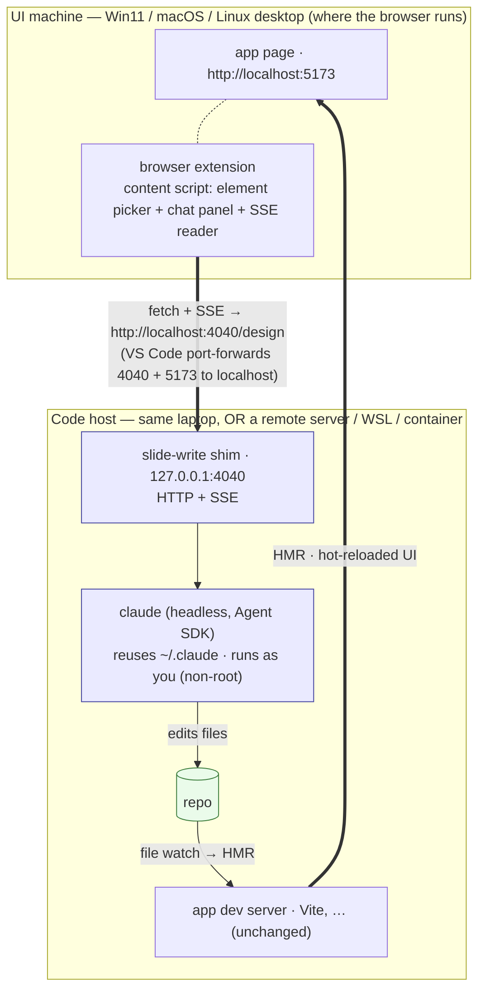

# Slide Write

**A portable, project-agnostic AI design assistant.** A browser extension injects an
element-picker + chat overlay into your running app. Click an element or type a request; a tiny
local **shim** drives **`claude`** headless against your repo; your dev server hot-reloads; the
change appears live — with **zero changes to the target project's source.**

The shim runs `claude` the same way your editor already does (headless, streaming) and reuses your
existing `~/.claude` login — **no API key, no Docker, no reverse proxy.** The browser reaches the
shim over **VS Code's built-in port forwarding**, so the exact same setup works whether your code
is on the laptop or on a remote server, on **Windows / macOS / Linux**.

> Two deliverables:
> 1. **`shim/`** — a cross-platform Node CLI: runs `claude` in a repo and streams the run as SSE on `127.0.0.1:<port>`.
> 2. **`extension/`** — a Manifest V3 browser extension: the universal, framework-agnostic UI.

## Demo

https://github.com/user-attachments/assets/3aec869a-b4e2-40f2-b51b-7c99191d2ff7

## Why I built this

I loved the DOM element picker paired with a Claude Code chat in claude.ai/design, but I needed a
tool that worked against a local development environment. Along the way I realized the same tool
could also generate and embed image assets.

This README is self-contained and buildable: it inlines every contract, the shim's core code, and
the extension spec. It's written to be implemented by **Claude Code** — see [§12](#12-build-order-for-claude).

---

## Table of contents

1. [What you get](#1-what-you-get)
2. [Repository layout](#2-repository-layout)
3. [Architecture](#3-architecture)
4. [Why this reaches everywhere](#4-why-this-reaches-everywhere)
5. [The shim (`shim/`)](#5-the-shim-shim)
6. [The SSE event contract](#6-the-sse-event-contract)
7. [The element-capture contract](#7-the-element-capture-contract)
8. [The browser extension (`extension/`)](#8-the-browser-extension-extension)
9. [Discovery & routing](#9-discovery--routing)
10. [Security model](#10-security-model)
11. [Quick start](#11-quick-start)
12. [Build order for Claude](#12-build-order-for-claude)
13. [Fallback: public-hostname access via a reverse proxy](#13-fallback-public-hostname-access-via-a-reverse-proxy)
14. [Prior art](#14-prior-art)

---

## 1. What you get

- A **browser extension** with a toolbar button / shortcut that injects a chat panel into the app's
  page. Type a prompt ("make the primary button green") → the shim drives `claude` → the running
  app hot-reloads → you see it in seconds.
- A **Markup mode**: hover to highlight elements, click one to describe a change anchored to it; the
  clicked element's context (tag, classes, text, DOM path) is sent so `claude` finds the source.
- The panel streams **thinking, tool calls, file edits, tool output, a final summary, and run
  stats** live over SSE, and shows the commit each run makes.
- **Reusable across projects.** The shim is generic; per-project knowledge comes from the target
  repo's own `CLAUDE.md`. Adding it to a project is: run the shim pointed at the repo, enable the
  origin in the extension. **No edits to the project's source.**

Single-developer, trusted-local tool ([§10](#10-security-model)).

---

## 2. Repository layout

```
.
├── README.md                       # this spec
├── CLAUDE.md                       # guidance for implementing/extending this repo
│
├── shim/                           # the local agent: claude → SSE on loopback
│   ├── package.json                # bin: "slide-write"; dep: @anthropic-ai/claude-agent-sdk
│   └── slide-write.mjs             # the CLI (HTTP server + SDK run loop + SSE mapping + commit)
│
└── extension/                      # the Manifest V3 browser extension (the universal UI)
    ├── manifest.json               # host_permissions: localhost; content script on localhost
    ├── background.js               # config store (chrome.storage); options/popup messaging
    ├── content/
    │   ├── inject.js               # bootstrap: mount the Shadow-DOM widget on enabled origins
    │   ├── picker.js               # capture-phase element picker (§8.3)
    │   ├── panel.js                # chat transcript + composer (renders the §6 events)
    │   └── sse.js                  # fetch + getReader SSE reader (§8.2, verbatim)
    ├── options.html
    ├── options.js                  # per-origin config: enabled + token + shim URL
    ├── popup.html
    ├── popup.js                    # quick enable/disable + "wired to <project>" via /meta
    └── styles.css                  # injected into the Shadow root only
```

No Docker, no compose overlay, no reverse-proxy config — the shim is a plain process and the
transport is VS Code's port forwarding.

---

## 3. Architecture

The shim binds **loopback on the machine where the code lives** (your laptop, or a remote
server/WSL/container). **VS Code's port forwarding** makes that loopback port — and your app's dev
port — appear at `localhost:<port>` on the machine where the browser runs. So the extension always
talks to `http://localhost:<port>`, and **local dev and remote dev look identical** to it.



The load-bearing property: **the shim and the dev server share the repo through the filesystem.**
`claude` writes files; the project's own dev server sees the change and hot-reloads. The shim never
imports the project's code.

---

## 4. Why this reaches everywhere

VS Code forwards loopback ports **identically** in every remote mode and on every OS — that's the
entire trick. Bind the shim to `127.0.0.1`, open your app via its forwarded `localhost` URL, and:

| Setup | Where the shim + code live | How the browser reaches the shim |
|---|---|---|
| **Local** (Win / macOS / Linux) | the laptop | direct `localhost:4040` (forwarding is a no-op) |
| **Remote-SSH** → a Linux server | the server | VS Code forwards over its SSH channel |
| **Windows + WSL** | WSL | VS Code forwards WSL → Windows localhost |
| **Dev Container** | the container | VS Code forwards container → host |
| **Codespaces / Tunnels** | the cloud VM | VS Code's forwarded URL |

From the browser's point of view everything is `localhost`, so there's **one extension code path
and one shim** — no topology awareness, no per-OS install. The one habit that keeps it uniform: in
remote dev, **open the app through its VS Code-forwarded `localhost` URL**, not a public hostname.
(If you must use a public hostname, see the [reverse-proxy fallback](#13-fallback-public-hostname-access-via-a-reverse-proxy).)

Credential portability is the `claude` CLI's job: the shim runs `claude` (via the Agent SDK), which
already knows where your login lives on each OS — so reusing your subscription works the same on
Windows, macOS, and Linux with no API key.

---

## 5. The shim (`shim/`)

A small Node CLI. It serves HTTP+SSE on loopback and drives `claude` headless via the Agent SDK.
Because it runs as **you (non-root)**, it can use `permissionMode: "bypassPermissions"` directly —
no permission-prompt callback, no root workarounds. Edits are written as your user, so they're
yours.

### 5.1 `shim/package.json`
```json
{
  "name": "slide-write",
  "version": "0.1.0",
  "type": "module",
  "bin": { "slide-write": "slide-write.mjs" },
  "dependencies": { "@anthropic-ai/claude-agent-sdk": "^0.3.168" }
}
```
The SDK reuses `~/.claude` automatically (or `ANTHROPIC_API_KEY` if set). Run with
`node shim/slide-write.mjs …`, or `npm i -g ./shim` then `slide-write …`, or `npx`.
*(Equivalent zero-dep alternative: shell out to `claude -p --output-format stream-json` and reframe
its JSONL as SSE — same event mapping. The SDK is used here for typed messages.)*

### 5.2 `shim/slide-write.mjs`

A single `.mjs` file. CLI flags / env
(`--port`/`--repo`/`--token`/`--origin`/`--model`/`--debug`/`--use-skills`, plus the image flags
`--gemini-key`/`--gemini-model`/`--image-instructions`) configure it; it stands up an
`http.createServer` on `127.0.0.1`, and the run logic lives in exported `runDesign(body, emit,
aborted)` / `runImage(body, emit, aborted, signal)` so the HTTP handler and tests share one
implementation (the server only starts when the file is run directly, behind an `import.meta.url`
guard).

**The system prompt is the interesting part** — it's what makes a generic shim behave well against
any repo. It's deliberately project-agnostic (per-project knowledge comes from the target's own
`CLAUDE.md`, loaded via `settingSources: ["project"]`):

```js
const PREAMBLE =
  "You are editing a web app live from within its running dev environment. Your edits land on the " +
  "repo at the working directory and the app's own dev server hot-reloads, so changes appear in the " +
  "browser within seconds.\n\n" +
  "FIRST, read the repo's CLAUDE.md (and README) for THIS project's conventions — where styling " +
  "lives, where components/screens live, the framework in use. Follow them.\n\n" +
  "- Make the SMALLEST focused change that satisfies the request, in the spirit of the existing code.\n" +
  "- Reuse existing tokens/components/patterns; don't add dependencies unless asked.\n" +
  "- Do NOT edit Dockerfiles, CI, or anything under .claude / .env / credentials.\n" +
  "- Keep schema/model changes ADDITIVE; never rename/drop/retype an existing column.\n" +
  "- When done, reply with one or two sentences describing exactly what you changed.";
```

The other load-bearing bit is **how a clicked element becomes prompt context.** `buildPrompt()`
joins the typed request with the current `screen` and a compact JSON of the element's
tag/class/text/`domPath`, then instructs `claude` to use those to locate the source:

```js
parts.push("\n[The user clicked this on-screen element and is referring to it]\n" +
  JSON.stringify(ctx, null, 2) +
  "\nUse the class names / text / DOM path to locate the source and matching styles, then edit there.");
```

When the request carries an element screenshot ([§7](#7-the-element-capture-contract)
`screenshotDataUrl`), `runDesign` writes it to a temp PNG **outside the repo** (`saveScreenshot()`,
the same temp-file pattern `runImage` uses) and `buildPrompt` appends a line telling `claude` to
`Read` that path — its Read tool renders the image, so the agent sees how the element looks before
editing. No Agent-SDK image-input plumbing is needed.

Everything else is mechanical and may be implemented freely as long as it honors these contracts:

- **The SDK run loop.** `query({ prompt, options })` is driven with `cwd: REPO`,
  `permissionMode: "bypassPermissions"` **plus** `allowDangerouslySkipPermissions: true` (the SDK
  requires both; the shim runs as you/non-root, so no permission callback is needed),
  `includePartialMessages: true`, `settingSources: ["project"]`, `systemPrompt: PREAMBLE`,
  `maxTurns: 40`. The loop dispatches on `m.type` and maps each SDK message to a §6 SSE event —
  `system/init`→`start`, `content_block_delta`→`delta`/`thinking_delta`, `tool_use`→`file_edit`
  (for Edit/Write/MultiEdit/NotebookEdit) or `tool`, `tool_result`→`tool_result`, `result`→`result`.
  `--debug`/`SW_DEBUG` logs each `m.type`/`m.subtype` to stderr. Bail immediately when `aborted()`
  (client disconnect) returns true. `--use-skills`/`SLIDEWRITE_USE_SKILLS` adds `skills: "all"` so the
  target repo's `.claude/skills/` are loaded (off by default — `settingSources:["project"]` alone does
  not enable skills).
- **Auto-commit only what this run changed.** Snapshot `git status --porcelain -uall` before the
  run, diff after, `git add` + commit just the new paths under a `Slide Write` identity (no push),
  emit `commit`. **Parse porcelain untrimmed** (`line.slice(3)`) — the leading status-column space
  is significant, so a path's first character would be eaten by a trimming helper.
- **HTTP server.** CORS (allow only `ORIGIN`; include `Access-Control-Allow-Private-Network`),
  a `Bearer <token>` gate on every route except `/health` (401 first), the `busy` single-run lock,
  and routes `/health`, `/meta`, `/history`, `/history/<id>`, `POST /design`, `POST /generate-image`.

**Validated against `@anthropic-ai/claude-agent-sdk` 0.3.168.** Message/block shapes (`stream_event`
deltas, `tool_use`/`tool_result` blocks) can drift across SDK versions; the loop dispatches on
`m.type` defensively — verify against the installed SDK during the phase-1 smoke test
([§12](#12-build-order-for-claude)).

---

## 6. The SSE event contract

Every frame is **one JSON object on a `data:` line**; the client reads only `data:`. Each has a
`type`. This is the interface between `shim/` and `extension/`.

| `type` | payload | client action |
|---|---|---|
| `start` | `{sessionId, model}` | status row "Started · `<model>`" |
| `delta` | `{text}` | append to the current assistant bubble |
| `thinking_delta` | `{text}` | append to the current thinking bubble |
| `tool` | `{tool, detail, id}` | compact tool row (`detail` = command/file/pattern) |
| `file_edit` | `{tool, path, id}` | edit row (✏️ `path`) |
| `tool_result` | `{tool, id, text, isError, truncated}` | collapsible output (auto-open on error) |
| `result` | `{isError, numTurns, durationMs, totalCostUsd, usage, result}` | stats footer; `result` is the final-text fallback if no deltas streamed |
| `commit` | `{sha, count}` | green "Committed `<sha>` · N files" |
| `image_status` | `{state}` | status row (`state:"generating"` → "generating image…"); emitted only by `/generate-image` |
| `image_generated` | `{tmpPath, mimeType, bytes}` | note row "🖼️ image generated"; metadata only (no image bytes over the wire) |
| `error` | `{message}` | error row |
| `done` | `{}` | end of stream; clear the busy indicator |

Adding a new `type` is backward-compatible: clients ignore unknown types.

| `user` | `{text}` | user bubble (history replay only; live runs render the user bubble inline in `send()`) |

The `user` event is emitted only by `GET /history/<id>` (below), not by a live `/design` run.

**Model selection (additive).** `/design` accepts an optional top-level `model` (a model id). The
shim validates it against an allowlist advertised by `/meta` (`{ models: [{id,label}], defaultModel }`);
an unknown/absent id falls back to the shim's `--model`/`SLIDEWRITE_MODEL` default, or the SDK's own
default when that's unset. The model the SDK actually runs is echoed back in the `start` event. The
extension renders the `/meta` list in a composer dropdown and persists the choice per-origin.

**Image generation (additive — Gemini "nano banana").** `POST /generate-image` is an SSE route
(same Bearer+CORS gate, same `busy` lock and per-run auto-commit as `/design`). It takes
`{ imagePrompt, element, geminiKey, imageInstructions, screen, model }`. The shim calls Google's
Generative Language API (model id from `--gemini-model`/`SLIDEWRITE_GEMINI_MODEL`, default
`gemini-2.5-flash-image`) with the key in an `x-goog-api-key` header — never the URL, so it can't
leak into logs. If `element.imageDataUrl` is present (the user picked an ``; the picker captured
its pixels via canvas), it's sent as an inline image part for image-to-image; otherwise it's
text-to-image. The decoded image is written to a temp file **outside the repo**, an `image_generated`
event fires, and the shim then drives `claude` (via the normal §6 stream) to copy the asset into the
project and wire it into the picked element. Key resolution: `body.geminiKey` →
`--gemini-key`/`GEMINI_API_KEY`; missing → an `error` event. `/meta` advertises
`{ geminiModel, geminiEnv }` (`geminiEnv` = the shim has a server-side key). The extension stores one
**global** Gemini key (shared across origins).

**Where image-save conventions live (precedence low→high).** Save path, naming, resizing, DB/CDN
steps differ per project, so they belong **in the target repo**, not the browser:

1. **`CLAUDE.md` `## Image assets` section** — the default; always in context, deterministic, no code
   change. The shim's image prompt already says "follow the project's image conventions."
2. **`.claude/skills/image-asset/SKILL.md`** — for *procedural* handling (resize with a bundled
   script, multi-dir, insert a `media` row, push to a CDN). A Skill can ship scripts and is
   model-invoked by its `description`. **Requires running the shim with `--use-skills`** (or
   `SLIDEWRITE_USE_SKILLS=1`) — `settingSources:["project"]` alone does *not* enable skills; that flag
   passes `skills:"all"` to the SDK query (and applies to `/design` too). Use a Skill when the
   procedure is large/reusable; use CLAUDE.md when it's just a path/naming rule.
3. **Per-origin “Image steps (override)”** — the extension field (sent as `imageInstructions`,
   appended last, wins). A per-developer override / quick experiment, *not* the source of truth.
   Falls back to `--image-instructions`/`SLIDEWRITE_IMAGE_INSTRUCTIONS`.

Minimal `.claude/skills/image-asset/SKILL.md` in a target repo:

```markdown
---
name: image-asset
description: Save a generated/provided image into this app and reference it. Use whenever an image
  file needs to be added to the project and wired into a component.
---
- Put images in `src/assets/generated/`, kebab-cased from the prompt, `.webp` when possible.
- Resize to max width 1024 with `node scripts/resize.mjs <file>`.
- Import the asset in the component (Vite `import url from '…'`); never hardcode `/public` paths.
- After adding, insert a row into the `media` table via `npm run media:register -- <path>`.
```

…or, for simple projects, just a CLAUDE.md stub:

```markdown
## Image assets
Generated images go in `public/img/`, kebab-cased; reference them with a root-relative `/img/…` URL.
```

**Chat history (read-only).** `claude` writes one `.jsonl` transcript per session under
`~/.claude/projects/<encoded-cwd>/` (the cwd with every non-alphanumeric char turned into a single
`-`; matched case-insensitively against the directory listing). Two GET routes, behind the same
Bearer+CORS gate as `/meta`, expose the **current repo's** sessions:

- `GET /history` → `{ sessions: [{ id, title, firstPrompt, startedAt, endedAt, branch, messageCount }] }`,
  newest first. `title` is the session's `ai-title` if present, else its first user prompt. Missing
  project folder → `{ sessions: [] }`.
- `GET /history/<id>` → `{ id, events: [...] }`, where `events` reuses the §6 shapes above (plus the
  `user` event) so the panel replays a past session through the same renderer. `id` must be a valid
  session UUID (regex-validated + path-traversal-guarded); a bad/missing id → 404. Lifecycle events
  (`start`/`commit`/`done`) are not emitted for a replay.

**Resume (additive).** `/design` accepts an optional top-level `resume` (a session UUID). When
present and valid, the shim passes `resume` to the SDK `query` so the run continues that
conversation. The `busy` lock and the per-run auto-commit (diff of `git status` before/after) are
unaffected — only files changed by *this* run are committed. An absent/invalid value starts fresh.
The extension's 🕘 history view offers a **↻ Resume** action that threads subsequent sends into the
chosen session.

---

## 7. The element-capture contract

When the user clicks an element in Markup mode, the extension POSTs (plus a top-level `screen` =
current route/view):

```jsonc
{
  "tag": "button",
  "id": null,
  "className": "btn btn-primary",   // full class string
  "text": "New",                    // textContent, trimmed, ≤120 chars
  "domPath": "div.topbar > button.btn.btn-primary",  // nth-of-type chain, ≤5 ancestors, stops at first id
  "rect": { "x": 1180, "y": 16, "w": 64, "h": 32 },
  "imageDataUrl": "data:image/png;base64,…",      // optional; present only when the target is an 
  "screenshotDataUrl": "data:image/png;base64,…", // optional; a screenshot of the picked element
  "screenshotW": 64, "screenshotH": 32            // UI-only (chip label); not forwarded to the shim
}
```
Centralized, semantic class names usually pinpoint the source; for CSS-in-JS / hashed classes, lean
on `text` + `domPath` + `screen`, or add framework-fiber data ([§8.4](#84-the-widget--remaining-files)).

`screenshotDataUrl` is captured on **every** pick: Chrome has no "screenshot this element" API, so the
background worker grabs the visible tab (`chrome.tabs.captureVisibleTab`) and the content script crops
it to `rect` (scaling by `devicePixelRatio`, clamping to the viewport, downscaling to a modest max
edge). Capture is best-effort — restricted pages, a zero-size rect, or a load failure just yield no
screenshot and the flow degrades to text-only. The composer shows it as a **removable attachment
chip** (thumbnail + dimensions + ✕); removing it drops the pixels so they're never sent. On `/design`
the screenshot IS sent (with the UI-only `screenshotW/H` stripped) — the shim writes it to a temp file
and asks `claude` to `Read` it ([§5](#5-the-shim-shim)). On `/generate-image` it's stripped (that route
uses `imageDataUrl` instead).

`imageDataUrl` is captured on every pick where the target is an `` whose pixels the picker could
read (same-origin / CORS-enabled canvas; tainted images are silently skipped). The composer keeps it
only when **Image Generation** is toggled on (the "+" menu in the send area) — then it drives
image-to-image in `/generate-image`; for plain `/design` sends the composer strips it back out, so it
never bloats a non-image request. Image Generation is a per-send toggle, not a separate picker: pick
any element with 🎯, flip the toggle, and the shim places the generated image as the ``'s `src`
or the element's CSS `background-image` depending on the element type.

---

## 8. The browser extension (`extension/`)

Manifest V3. The UI is **injected** into the page via a content script, rendered into a **Shadow
DOM** so host and panel styles never collide.

### 8.1 `manifest.json`
```jsonc
{
  "manifest_version": 3,
  "name": "Slide Write",
  "version": "0.1.0",
  "permissions": ["storage", "scripting", "activeTab"],
  "host_permissions": ["http://localhost/*", "http://127.0.0.1/*", "https://localhost/*"],
  "background": { "service_worker": "background.js" },
  "action": { "default_popup": "popup.html" },
  "content_scripts": [{
    "matches": ["http://localhost/*", "http://127.0.0.1/*", "https://localhost/*"],
    "js": ["content/inject.js"],
    "run_at": "document_idle"
  }]
}
```
`http://localhost/*` matches any port, so it covers every project's dev server and the forwarded
shim port. `inject.js` mounts the widget only if `chrome.storage` has an **enabled** entry for
`location.origin` — inert otherwise. (For the reverse-proxy fallback, add your public host here.)

### 8.2 `content/sse.js` — the SSE reader (verbatim; runs in the content script, not the SW)
⚠️ The stream lives in the **content script** because MV3 service workers are killed after ~30s
idle, mid-run. `EventSource` can't POST or set headers, so read the `fetch` body manually:
```js
export async function streamDesign(shimUrl, token, payload, onEvent, signal) {
  const res = await fetch(`${shimUrl}/design`, {
    method: "POST",
    headers: { "Content-Type": "application/json", "Accept": "text/event-stream",
               "Authorization": `Bearer ${token}` },
    body: JSON.stringify(payload), signal,
  });
  if (!res.ok || !res.body) throw new Error(`design failed: ${res.status}`);
  const reader = res.body.getReader();
  const decoder = new TextDecoder();
  let buf = "";
  while (true) {
    const { value, done } = await reader.read();
    if (done) break;
    buf += decoder.decode(value, { stream: true });
    let sep;
    while ((sep = buf.indexOf("\n\n")) !== -1) {
      const frame = buf.slice(0, sep); buf = buf.slice(sep + 2);
      const data = frame.split("\n").filter(l => l.startsWith("data:"))
                        .map(l => l.slice(5).replace(/^ /, "")).join("\n");
      if (data) { try { onEvent(JSON.parse(data)); } catch {} }
    }
  }
}
```
`shimUrl` is the per-origin value from config, e.g. `http://localhost:4040`.

### 8.3 `content/picker.js` — the element picker (capture-phase)
1. **Listen on `window` in the capture phase** for `mousemove`/`click`. Capture-phase
   `preventDefault()` + `stopPropagation()` on click means marking an element **never triggers the
   app's own handlers**.
2. **`document.elementFromPoint`**, then walk up and **skip your own UI** — tag every node you
   render with `data-slidewrite-ui` and ignore hits inside one:
   ```js
   function skipOwnUI(el) {
     let n = el;
     while (n && n !== document.body && n !== document.documentElement) {
       if (n.dataset && "slidewriteUi" in n.dataset) return null;
       n = n.parentElement;
     }
     return (!el || el === document.body || el === document.documentElement) ? null : el;
   }
   ```
3. **Highlight box is `position:fixed; pointer-events:none`** at the target's `getBoundingClientRect()`.
4. **Capture the [§7](#7-the-element-capture-contract) context**, leave markup mode, open the composer
   anchored to the element. Build `domPath` as an `nth-of-type` chain of ≤5 ancestors, stopping at the first `id`.

### 8.4 The widget & remaining files
- **`content/panel.js`** — transcript + composer. Renders each [§6](#6-the-sse-event-contract) event
  as a row; **coalesce consecutive same-role streaming deltas** into one bubble; tool/result rows
  break the chain. Footer textarea (⌘/Ctrl+Enter), disabled while a run is in flight;
  `AbortController` cancels on close. The composer's toolbar row holds a model selector (populated
  from `/meta`, persisted per-origin) and the send button, modeled on the Claude AI chat composer.
  A 🕘 header button opens a **history view**: `GET /history` lists this repo's past sessions; picking
  one calls `GET /history/<id>` and **replays it read-only** through the same `onEvent` renderer (the
  live transcript is left intact). A **↻ Resume** action sets a resume chip and threads subsequent
  sends into that session via the `/design` `resume` field.
- **`content/sse.js`** — the SSE reader plus `fetchHistory`/`fetchHistoryDetail` JSON GET helpers.
- **`content/inject.js`** — create a host node + `attachShadow({mode:'open'})`, inject `styles.css`
  into the shadow root, mount the panel + a toolbar affordance, wire the shortcut. Look up config for
  `location.origin`; call `GET <shimUrl>/meta`; show "wired to `<project>` @ `<branch>`" in the header.
- **`background.js`** — owns `chrome.storage` config; serves get/set to options & popup. No network.
- **`options.html/js`** — per-origin rows: `{ origin, enabled, token, shimUrl }`.
- **`popup.html/js`** — toggle enable for the active tab's origin; show `/meta` confirmation.
- **`styles.css`** — scoped to the shadow root (`:host`, `.sw-*`).

**Extension-only superpower (roadmap):** because the content script runs *in the page*, it can read
the React fiber (`__reactFiber$…`) on the clicked node to recover the component name + `_debugSource`
(file:line) in dev builds, and send it alongside the DOM context — far more precise than
class/`domPath` grepping for CSS-in-JS / hashed-class projects. Optional, framework-specific.

---

## 9. Discovery & routing

Per origin, the options page stores `{ enabled, token, shimUrl }` — e.g.
`http://localhost:5173 → http://localhost:4040`. The shim and app run on different ports
(cross-origin), so `shimUrl` is explicit (not derivable). On load the content script looks up
`location.origin`; if enabled, it calls `GET <shimUrl>/meta` and shows **"wired to `<project>` @
`<branch>`"** so you can confirm the tab points at the repo you expect. Run several projects at once
— each shim on its own port, each origin mapped accordingly.

---

## 10. Security model

The shim runs **arbitrary code edits + shell** in a repo as you. Defenses:

- **Loopback bind.** The shim listens on `127.0.0.1` only — never a public interface. It's reachable
  from the browser solely through VS Code's port forward (authenticated by the VS Code remote
  connection) or directly on the same machine.
- **Bearer token.** Every route except `/health` requires `Authorization: Bearer <SLIDEWRITE_TOKEN>`;
  reject with 401 first. Use a random secret per project; never commit it.
- **CORS allowlist = anti-CSRF.** A JSON POST triggers a preflight; the shim only approves your app's
  origin, so a random site you browse can't drive the shim even though it's on localhost. Combined
  with the token, two independent gates.
- **Runs as you (non-root).** Edits are host-owned; `bypassPermissions` is allowed without root
  hacks. Optional hardening: a `canUseTool` deny-list (WebFetch/WebSearch, `git push`) to blunt
  prompt-injection exfiltration.
- **Prompt injection.** A malicious string in the repo could steer `claude`; the working-directory
  boundary (`cwd: REPO`) is the main mitigation. For higher assurance, run against a throwaway `git worktree`.
- **History is read-only and repo-scoped.** `/history*` only read `~/.claude/projects/<this repo>/`;
  the session `id` is UUID-validated and path-traversal-guarded before any file read, so the route
  can't be coerced into reading other projects or arbitrary files. Same Bearer+CORS gate as `/meta`.

Single-developer, trusted-local only. Not multi-tenant or public.

---

## 11. Quick start

**Prerequisites:** Claude Code installed and logged in (`claude` on PATH), Node 18+, VS Code.

**Per machine (once):**
```bash
cd shim && npm install        # pulls @anthropic-ai/claude-agent-sdk
```

**Per project:** run the shim pointed at the repo, on its own port:
```bash
node shim/slide-write.mjs --repo /path/to/project --port 4040 \
  --origin http://localhost:5173 --token "$(openssl rand -hex 16)"
```
Add `--debug` (or set `SW_DEBUG=1`) to log every SDK message (`type`/`subtype`) to stderr during a
run — useful for seeing the raw message sequence before it's translated into SSE events.
In **remote/WSL/container** dev, run this in a VS Code terminal on the code host — VS Code
auto-forwards port 4040 (and your dev server's port) to your laptop's `localhost`. Open the app via
its forwarded `localhost` URL.

**In the extension (once per project):** open options → add origin `http://localhost:5173`, set
`shimUrl http://localhost:4040` + the token, enable. Then open the app, click the toolbar button,
and design. To stop: kill the shim process.

---

## 12. Build order for Claude

Each phase is independently testable; build and verify in order.

1. **Shim.** Implement `shim/package.json` + `shim/slide-write.mjs` ([§5](#5-the-shim-shim)). Then:
   ```bash
   node shim/slide-write.mjs --repo "$PWD" --port 4040 --token test --origin http://localhost:5173 &
   curl -s localhost:4040/health
   curl -s -H 'Authorization: Bearer test' localhost:4040/meta
   curl -sN -X POST localhost:4040/design -H 'Authorization: Bearer test' \
     -H 'Content-Type: application/json' -d '{"prompt":"append a CSS comment to <some file>"}'
   ```
   Expect `start → file_edit → result → commit → done`, then one scoped commit
   (`git reset --hard HEAD~1` to clean up). Confirm SDK message shapes here.
2. **Extension — minimal.** `manifest.json`, `background.js`, `options.*`, `content/inject.js` +
   `content/sse.js` + `content/panel.js` (chat only, no picker). Drive a text-prompt change end to
   end from the browser; render the [§6](#6-the-sse-event-contract) events.
3. **Extension — picker.** `content/picker.js` ([§8.3](#83-contentpickerjs--the-element-picker-capture-phase));
   send the [§7](#7-the-element-capture-contract) contract; anchored composer; markup toggle.
4. **Polish.** Popup enable/disable, auto-reload-on-`commit` option, token UX, the [§10](#10-security-model) checklist.
5. **History & resume.** Add the `/history` + `/history/<id>` routes and the `resume` field
   ([§6](#6-the-sse-event-contract)) to the shim, then the 🕘 history view + ↻ Resume in the panel. Verify:
   ```bash
   curl -s -H 'Authorization: Bearer test' localhost:4040/history            # {sessions:[…]} newest-first
   curl -s -H 'Authorization: Bearer test' localhost:4040/history/<uuid>     # {id,events:[…]} (404 on bad id)
   curl -sN -X POST localhost:4040/design -H 'Authorization: Bearer test' \
     -H 'Content-Type: application/json' -d '{"prompt":"what did you just change?","resume":"<uuid>"}'
   ```
   Expect the resumed run to reference prior context and still commit only its own changes. In the UI:
   🕘 → pick a session → read-only replay → ↻ Resume → follow-up threads into that session.
6. **(Optional)** fiber-based element resolution ([§8.4](#84-the-widget--remaining-files)).

---

## 13. Fallback: public-hostname access via a reverse proxy

Use this **only** if you must open the app at a public hostname (e.g. `https://app.example.com`)
instead of a VS Code-forwarded `localhost` URL. A public-origin page calling `localhost` hits
cross-origin + Chrome's Private/Local Network Access checks, so instead mount the shim on the app's
**own hostname** under a path prefix, making the call same-origin.

With Traefik (Docker-label form), route `Host(app) && PathPrefix(/_slidewrite)` → StripPrefix →
the shim's port, at higher priority than the app's catch-all router. The extension then uses
`shimUrl = location.origin + "/_slidewrite"`. Bind the shim to the proxy network instead of pure
loopback, and keep the token + an `ipAllowList` middleware as the boundary. This is strictly more
setup than the default; prefer VS Code forwarding whenever you can.

---

## 14. Prior art

The *visual-edit → source* space is active — worth a scan before building:
- **Locator.js** — click a rendered element, jump to its component source (validates §8.4).
- **Onlook**, **Builder.io Visual Copilot** — visual editing that emits code changes.

The distinctive angle here: a **generic local shim driving your already-installed `claude` against
the real repo, surfaced in any app via a browser extension, reaching every dev topology through VS
Code's port forwarding** — no Docker, no proxy, no API key, zero frontend footprint.
